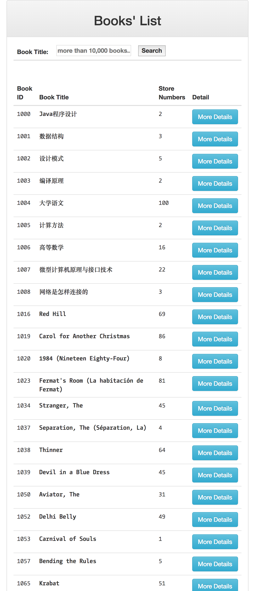
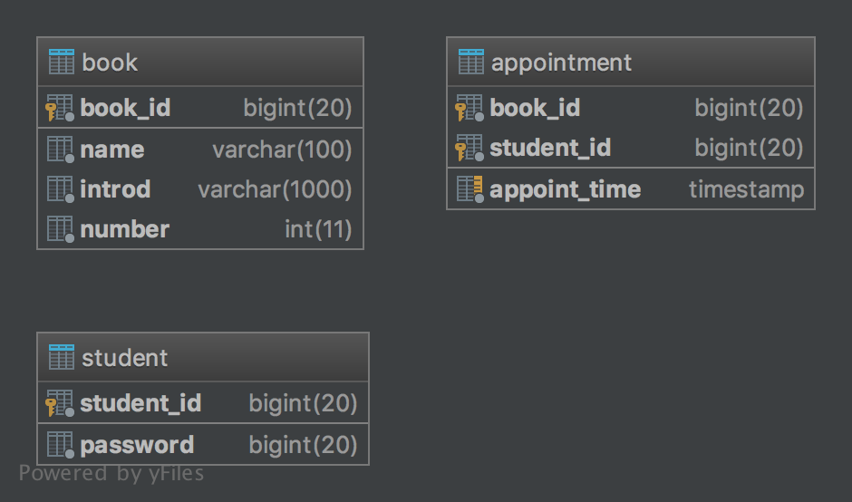

# Java_SSM_BookReservation

## 1 项目简介

Spring, Maven 框架下的图书预约系统。



## 2 项目结构

```powershell
.
├── classes 							# 编译文件
├── img									# README.md 插图 
├── src 								# 源代码
│   └── main
│       ├── java
│       │   └── com
│       │       └── imooc
│       │           └── appoint
│       │               ├── dao
│       │               ├── dto
│       │               ├── entiy
│       │               ├── enums
│       │               ├── exception
│       │               ├── service
│       │               │   └── Impl
│       │               └── web
│       ├── resources
│       │   ├── mapper
│       │   └── spring
│       └── webapp
│           ├── WEB-INF
│           │   └── jsp
│           │       └── common
│           └── resources
│               └── script
└── target								# 可执行文件

```

## 3 数据库脚本文件

在数据库 `ssmbookappoint` 下建立以下三个表：

```sql
CREATE TABLE appointment
(
    book_id BIGINT NOT NULL
    COMMENT '图书ID',
    student_id BIGINT NOT NULL
    COMMENT '学号',
    appoint_time TIMESTAMP DEFAULT CURRENT_TIMESTAMP NOT NULL
    ON UPDATE CURRENT_TIMESTAMP
    COMMENT '预约时间',
    PRIMARY KEY (book_id, student_id)
)
    COMMENT '预约图书表'
    ENGINE = InnoDB;

CREATE INDEX idx_appoint_time
    ON appointment (appoint_time);

CREATE TABLE book
(
    book_id BIGINT AUTO_INCREMENT
    COMMENT '图书ID'
        PRIMARY KEY,
    name VARCHAR(100) NOT NULL
    COMMENT '图书名称',
    introd VARCHAR(1000) NOT NULL
    COMMENT '简介',
    number INT NOT NULL
    COMMENT '馆藏数量'
)
    COMMENT '图书表'
    ENGINE = InnoDB;

CREATE TABLE student
(
    student_id BIGINT NOT NULL
    COMMENT '学生ID'
        PRIMARY KEY,
    password BIGINT NOT NULL
    COMMENT '密码'
)
    COMMENT '学生统计表'
    ENGINE = InnoDB;
```

表之间无外键关联，结构如下：



紧接着插入数据。


